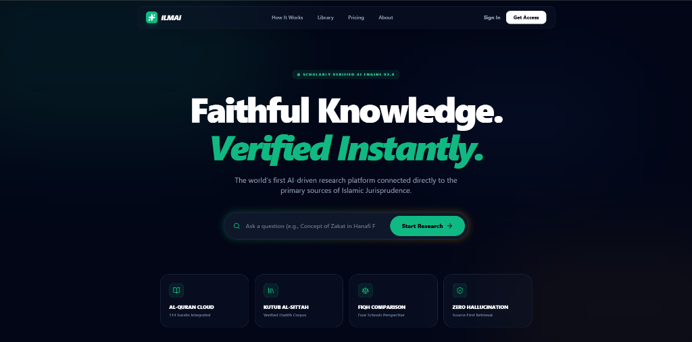
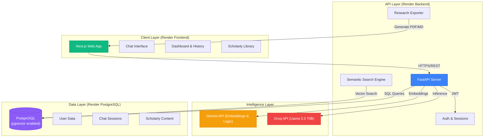
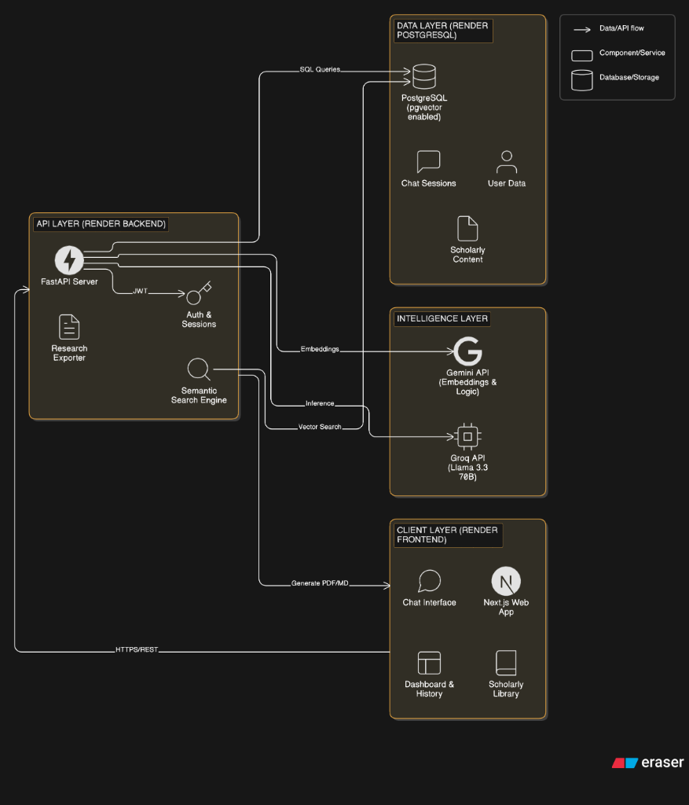

# IlmAI: Advanced Scholarly AI Research Engine

IlmAI is a premium, AI-powered research platform designed for scholars and students of Islamic knowledge. It provides a state-of-the-art interface for exploring Quran, Hadith, and Fiqh with academic precision.



## 🌟 Key Features

- **Neural Semantic Search**: Beyond simple keywords. IlmAI understands the thematic and conceptual meaning of your queries using neural embeddings.
- **Comparative Fiqh Mode**: Side-by-side analysis of rulings across the major Madhahib (Hanafi, Shafi'i, Maliki, Hanbali).
- **Scholarly Digital Whitepapers**: One-click research export with professional typography and academic formatting.
- **Premium Glassmorphic UI**: High-fidelity, atmospheric interface designed for deep focus and study.
- **Multi-lingual Intelligence**: Full support for English and Bangla scholarly research.

## 🛠️ Tech Stack

- **Frontend**: Next.js 15, Tailwind CSS, Framer Motion, Lucide Icons.
- **Backend**: FastAPI (Python), SQLAlchemy, Groq (Llama 3.3 70B), SentenceTransformers.
- **Database**: SQLAlchemy with PostgreSQL (`pgvector` enabled).

## 🏗️ System Architecture

IlmAI leverages a multi-layer neural architecture to ensure faithful retrieval and scholarly accuracy.





## 🚀 Quick Start

### Backend Setup

1. Navigate to the `backend` directory.
2. Install dependencies:
   ```bash
   pip install -r requirements.txt
   ```
3. Setup environment variables in a `.env` file (see `.env.example`).
4. Start the server:
   ```bash
   python -m uvicorn app.main:app --reload
   ```

### Frontend Setup

1. Navigate to the `frontend` directory.
2. Install dependencies:
   ```bash
   npm install
   ```
3. Start the development server:
   ```bash
   npm run dev
   ```

## 🚀 Deployment

The platform is live and operational:

- **Frontend**: [https://ilmai-frontend-v8-pathwise.onrender.com/](https://ilmai-frontend-v8-pathwise.onrender.com/)
- **Backend API**: [https://ilmai.onrender.com](https://ilmai.onrender.com)

For professional hosting instructions, including Vercel, Railway, and Docker-based VPS setups, please see our [Deployment Guide](DEPLOYMENT.md).

## 📜 Scholarly Guidelines

IlmAI is a research aid. While it retrieves verified sources, users are encouraged to consult qualified scholars for practical religious applications.

---

_Built for the preservation and study of sacred knowledge._
